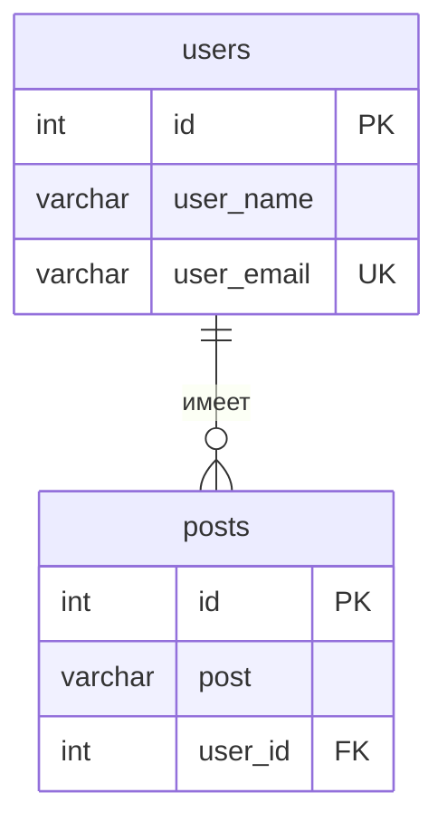

# Сервер на Express

**REST API** для пользователей и постов: **Express 5**, **Sequelize**, **PostgreSQL**, связь *один ко многим*.

[Node.js](https://nodejs.org/)  
[Express](https://expressjs.com/)  
[PostgreSQL](https://www.postgresql.org/)  
[Sequelize](https://sequelize.org/)

## О проекте

Учебный backend: чистый **Express**, модели через **Sequelize**, данные в **PostgreSQL**. Подходит как заготовка для пет-проекта или песочницы для экспериментов с CRUD и связями.

---

## Содержание

- [Возможности](#возможности)
- [Стек](#стек)
- [Быстрый старт](#быстрый-старт)
- [Переменные окружения](#переменные-окружения)
- [Схема данных](#схема-данных)
- [API](#api)
- [Структура репозитория](#структура-репозитория)

---

## Возможности


| Область           | Что есть                                                                       |
| ----------------- | ------------------------------------------------------------------------------ |
| **Пользователи**  | Полный CRUD: список, один по `id`, создание, обновление, удаление              |
| **Посты**         | Выборка и создание постов **для выбранного пользователя** (`?id=` = `user_id`) |
| **Связь в БД**    | `posts.user_id` → `users.id`                                                   |
| **Бизнес-логика** | Уникальность `user_email` при создании и обновлении                            |


---

## Стек

```
┌─────────────┐     ┌──────────┐     ┌────────────┐
│   Express   │ ──▶ │ Sequelize│ ──▶ │ PostgreSQL │
│   (HTTP)    │     │   (ORM)  │     │    (БД)    │
└─────────────┘     └──────────┘     └────────────┘
```


| Компонент  | Технология                               |
| ---------- | ---------------------------------------- |
| Runtime    | Node.js, ES modules (`"type": "module"`) |
| Сервер     | Express 5                                |
| ORM        | Sequelize 6                              |
| Драйвер БД | `pg`                                     |
| Конфиг     | `dotenv`                                 |
| Разработка | `nodemon`                                |


---

## Быстрый старт

**1.** Клонируйте репозиторий и установите зависимости:

```bash
git clone <url-репозитория>
cd nodePostgres
npm install
```

**2.** Создайте базу в PostgreSQL и примените DDL из `[src/db.sql](src/db.sql)`:

```bash
psql -U postgres -d имя_базы -f src/db.sql
```

**3.** В корне создайте `.env` (файл в `.gitignore` — не коммитится). См. [переменные ниже](#переменные-окружения).

**4.** Запуск в режиме разработки:

```bash
npm run dev
```

В консоли: `Listening on port 3000` (или ваш `PORT`).

---

## Переменные окружения

Создайте файл `.env` в корне проекта:

```env
DB_NAME=имя_базы
DB_USER=пользователь_postgres
DB_PASSWORD=пароль
DB_HOST=localhost
DB_DIALECT=postgres
PORT=3000
```

> **Подсказка.** `PORT` можно не задавать — по умолчанию используется **3000**.

---

## Схема данных

Таблицы задаются в `[src/db.sql](src/db.sql)`:

- **users** — `id`, `user_name`, `user_email` (уникальный email)
- **posts** — `id`, `post`, `user_id` (внешний ключ на `users`)




---

## API

**База:** `http://localhost:3000` (если не меняли `PORT`).

### Пользователи  `/api/users`


| Метод  | Путь             | Действие          |
| ------ | ---------------- | ----------------- |
| GET    | `/api/users`     | Все пользователи  |
| GET    | `/api/users/:id` | Один пользователь |
| POST   | `/api/users`     | Создать           |
| PUT    | `/api/users/:id` | Обновить          |
| DELETE | `/api/users/:id` | Удалить           |


**Тело** для `POST` / `PUT` (JSON):

```json
{
  "user_name": "Иван",
  "user_email": "ivan@example.com"
}
```


| Код   | Когда                  |
| ----- | ---------------------- |
| `409` | Email уже занят        |
| `404` | Пользователь не найден |


---

### Посты `/api/posts`

Параметр `**id**` в query — это `**user_id**` (владелец постов).


| Метод | URL                       | Действие                                                |
| ----- | ------------------------- | ------------------------------------------------------- |
| GET   | `/api/posts?id=<user_id>` | Посты пользователя (в ответе подтягивается `user_name`) |
| POST  | `/api/posts?id=<user_id>` | Создать пост                                            |


**Тело POST:**

```json
{
  "post": "Текст поста до 255 символов"
}
```

**Пример запроса:**

```bash
curl "http://localhost:3000/api/posts?id=1" ^
  -H "Content-Type: application/json" ^
  -d "{\"post\":\"Привет, мир!\"}"
```

На macOS / Linux замените `^` на `\` для переноса строки или выполните в одну строку.

---

## Структура репозитория

```
src/
├── app.js              # Express, JSON, маршруты
├── db.sql              # DDL для PostgreSQL
├── controllers/        # Логика ответов HTTP
├── models/             # Sequelize: User, Post, sequelize
├── routes/             # /api/users, /api/posts
└── services/           # под расширение
```

---

## Лицензия

**ISC** — см. [`package.json`](package.json).

---


Express · PostgreSQL · Sequelize

